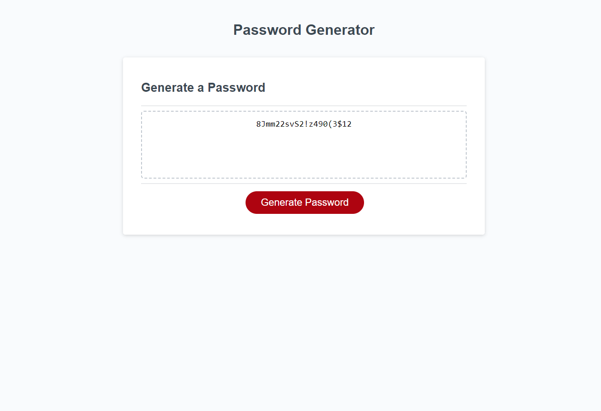

# Password Generator Module 3

## Description

This is a password generator capable of generating a password of 8-128 characters with at least one of the following types: lowercase, uppercase, numbers, special characters.  The length and character types are chosen by the user.

https://bpoole53.github.io/password-gen-mod-3/

## Installation

N/A

## Usage

Be able to generate a password of 8-128 characters with at least one of the following types: lowercase, uppercase, numbers, special characters.

## Credits

N/A

## License

N/A

